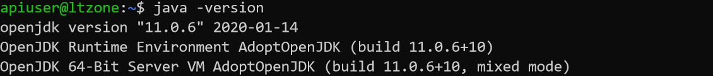

在[上一篇日志](https://www.ltzhou.com/sg-springinit)中我们说到可以将本地打包生成的jar包直接上传到服务器运行, 在[配置Jupyter](https://www.ltzhou.com/ecs-jupyter)时, 我们介绍了apache2反向代理实现二级域名到端口映射的方法. 由于微信小程序要求后端API必须具有https协议, 本节将会实现通过SpringBoot框架搭建的API接口(https)的实现.

<!-- more -->

[toc]

## 在服务器安装AdoptOpenJDK

按照AdoptOpenJDK官网的[安装指示](https://adoptopenjdk.net/installation.html?variant=openjdk11&jvmVariant=hotspot#linux-pkg), 我们可以使用`apt-get`安装, 但由于使用的是官方源, 下载速度较慢. 我们采用[清华源](https://mirrors.tuna.tsinghua.edu.cn/AdoptOpenJDK/11/jdk/x64/linux/?C=M&O=D)手动安装. 版本与本地一致. 我们在服务器中使用一个apiuser用于运行api相关的程序. 在用户目录下下载压缩包,解压.


```
wget https://mirrors.tuna.tsinghua.edu.cn/AdoptOpenJDK/11/jdk/x64/linux/OpenJDK11U-jdk_x64_linux_hotspot_11.0.6_10.tar.gz
tar -xzvf OpenJDK11U-jdk_x64_linux_hotspot_11.0.6_10.tar.gz
```
将解压的文件移动到`usr/java`下, 并在`/etc/profile`最后配置如下环境变量.
```
export JAVA_HOME=/usr/java/jdk-11.0.6+10
export JRE_HOME=$JAVA_HOME/jre
export CLASSPATH=.:$JAVA_HOME/lib:$JRE_HOME/lib
export PATH=$JAVA_HOME/bin:$PATH
```

退出后,执行`source /etc/profile`使环境变量生效.

使用`java -version`命令, 检查是否配置成功.



## Apache配置反向代理

我们希望通过jvm运行的Web应用可以在8000端口运行, 由Apache通过反向代理将`api.ltzhou.com`二级域名重定向. 首先激活下列配置文件.

在`/etc/apache2/sites-available`中添加`api.conf`文件

```
<VirtualHost *:443>
    ServerName api.ltzhou.com
    ServerAdmin webmaster@localhost

    ErrorLog ${APACHE_LOG_DIR}/api-host.ltzhou.com-error_log
    CustomLog ${APACHE_LOG_DIR}/api-host.ltzhou.com-access_log combined

    SSLEngine On
    SSLCertificateFile      ..._public.crt
    SSLCertificateKeyFile   ....key
    SSLCertificateChainFile ....crt

    SSLProxyEngine On

    RewriteEngine On
    RewriteCond %{HTTP:Connection} Upgrade [NC]
    RewriteCond %{HTTP:Upgrade} websocket [NC]
    RewriteRule /(.*) wss://127.0.0.1:8000/$1 [P,L]

    ProxyPreserveHost on
    ProxyPass / https://127.0.0.1:8000/
    ProxyPassReverse / https://127.0.0.1:8000/
</VirtualHost>
```

激活配置文件.
```
a2ensite api.conf
systemctl reload apache2
```

## 为项目配置SSL连接

Recall上一篇博文中, 我们已通过`.htaccess`文件实现了`http`到`https`地址的重写. 因此这里配置完成Apache2后, 所有访问`api.ltzhou.com`的地址都会被反向代理到`https://server-ip:8000/`端口, 但在SpringBoot的Web配置中, 访问依然是通过`http`协议的, 因此会出现not found的错误. 我们还需要在java项目中配置`https`的SSL连接.

首先从阿里云的SSL控制台下载二级域名对应的SSL证书, 我们选择tomcat形式. 解压得到一个`pfx`文件和一个记有密钥的`txt`文件.

在本地用命令行定位到java安装目录下. 使用keytool工具将`pfx`文件打包.

```
cd C:\Program Files\AdoptOpenJDK\jdk-11.0.6.10-hotspot\bin
keytool -importkeystore -srckeystore D:\api.ltzhou.com.pfx -destkeystore D:\api.jks -srcstoretype PKCS12 -deststoretype JKS
```

输入密钥的密码.


将转化后的证书文件放到java项目目录下, 同时在`application.properties`文件中输入如下配置.

```
server.port=8000
server.ssl.key-store=classpath:api.jks
server.ssl.key-store-password=fUHAPAlU
server.ssl.key-store-type=JKS
server.ssl.key-alias=alias
```


运行, 成功编译, 在本地浏览器我们就可以通过https访问对应端口了. 当然, 由于本地地址没有和二级域名对应, 浏览器会提示不安全.

## 在服务器运行jar包

使用Maven的Package工具, 完成jar包的打包. 我们使用`scp`工具将本地jar包上传到服务器


使用ssh登录服务器, 使用`java -jar`命令运行jar包. 成功运行. 且通过浏览器访问`https://api.ltzhou.com/hello` 我们可以得到安全链接下的返回值.


要让jar包中的web应用持续后台运行, 执行如下命令.

```
nohup java -jar api-0.0.1-SNAPSHOT.jar &
```

关闭线程时,可以先查询线程号, 再使用kill命令.
```
ps -ef | grep java
kill -9 15968
```


## References

[【Linux】 JDK安装及配置 (tar.gz版)](https://www.cnblogs.com/h--d/p/5071643.html)
[Spring Boot配置ssl证书](https://blog.csdn.net/sinat_40399893/article/details/79860942)