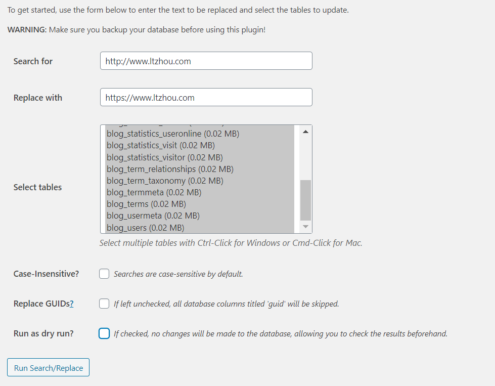
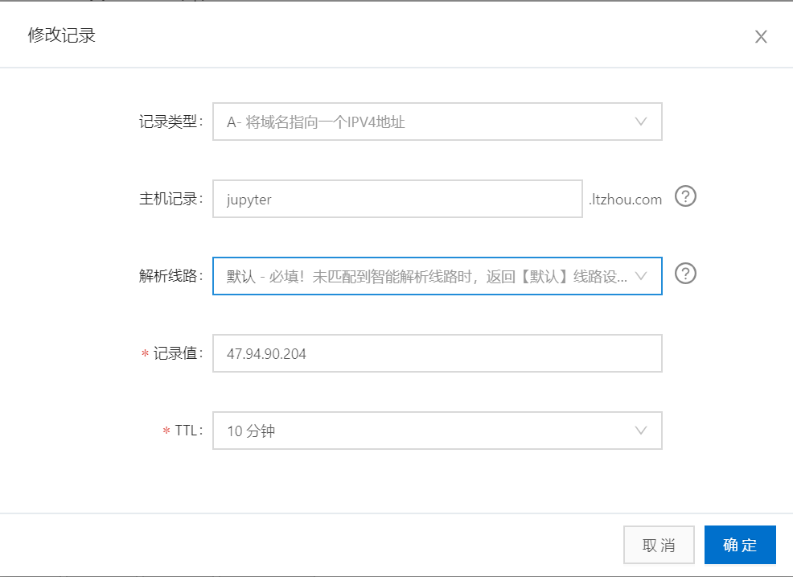

之前在服务器上安装了一个jupyter notebook，已经用来做两次大数据的作业了，体验很好，挂着跑十来分钟的迭代算法都不是问题。但每次连接时都需要在一级域名后面加一个端口号，让人很不爽。所以今天想办法利用Apache2的反向代理为jupyter notebook的端口分配了一个二级域名。顺便将WordPress的博客和jupyter notebook分配了SSL，升级成HTTPS的URL。本来反向代理和SSL两边好用的教程都不多，合在一起一折腾就折腾了一个晚上，通过不断的调试，虽然底层配置还有些不明确的地方，但总算差不多把目的实现了。特此记录一下学习和踩坑的经过。

<!-- more -->

[toc]

## 背景

- 阿里云ECS服务器。

- Ubuntu18.04 + Apache2 + MySQL + WordPress的博客用root权限配置在一级域名（www）下。

- 另外已有一个jpuser权限（有sudo权限）配置的Jupyter Notebook，目前的端口号是8889，阿里云安全组已配置。

- 在阿里云（万网）注册的顶级域名（ltzhou.com）

## SSL证书

SSL证书当然是有免费的注册方式的，如果直接购买阿里云的一键配置服务也就不会有这篇文章那么多事了。在[SSL控制台](https://yundun.console.aliyun.com/?spm=5176.13329450.nav-right.1.51494df5WQ9ivc&p=cas#/overview/cn-hangzhou)中，选择购买证书，选择免费版购买。


注册相关信息后，等待约半小时的审核，就可以在SSL控制台看到通过审核的证书。


由于免费版的SSL只支持注册单个二级域名，因此针对我们需要的二级域名地址需要准备单独的SSL证书进行配置，这里我注册了3个，阿里云最多允许个人注册20个。

首先我们对主页（www）博客进行SSL配置，下载对应的Apache证书，解压会得到三个文件，`xxx_chain.crt、xxx_public.crt、xxx.key`，`xxx`的命名无关紧要。将这三个文件拷贝到服务器的Apache的安装目录下，如`/etc/apache2/ssl/`。下面我们需要在Apache中修改配置文件。

## Apache2在Debian系统中的配置方法

Apache在各个不同系统中的配置文件布局方式很不同，这里简单介绍一下在Debian系统中的配置机制。Apache2目录下，有`conf_available, mods_available, sites_available`这些目录，这些相当于是各类配置文件，这些文件通过软连接的方式与`conf_enable, mods_enable, sites_enable`目录下的文件连接。当存在软连接时，就表明对应的配置或模块被启用，反之则被禁用。因此整个配置系统被拆分成了若干段，统一由`apache2.conf`控制。当我们需要修改时，无需修改一个长长的配置文件，只需关心对应的模块即可。

Apache还提供了在命令行上的快捷指令，`a2enmod`可以启用对应模块。为了开启反向代理和ssl功能，我们需要运行以下命令。`a2enmod`可以帮我们管理`mods`目录的启用情况。
```
a2enmod ssl rewrite proxy proxy_http proxy_wstunnel
```

HTTP连接使用的是`80`端口，而HTTPS（SSL）连接使用的是`443`端口，相当于是一个新的站点，因此我们需要在`sites_available`中创建新的针对`443`端口的配置文件。

在`sites_available`中新建名为`default-ssl.conf`文件如下。文件中主要说明了服务器域名、SSL配置文件的地址。

```
<IfModule mod_ssl.c>
  <VirtualHost *:443>
      ServerAdmin webmaster@localhost
      ServerName www.ltzhou.com
      DocumentRoot /var/www/html

      ErrorLog ${APACHE_LOG_DIR}/error.log
      CustomLog ${APACHE_LOG_DIR}/access.log combined

      SSLEngine on
      SSLCertificateFile      _path_to_your_public.crt
      SSLCertificateKeyFile   _path_to_your_.key
      SSLCertificateChainFile _path_to_your_chain.crt
      <FilesMatch "\.(cgi|shtml|phtml|php)$">
        SSLOptions +StdEnvVars
      </FilesMatch>
      <Directory /usr/lib/cgi-bin>
        SSLOptions +StdEnvVars
      </Directory>
    </VirtualHost>
</IfModule>
```

接下来我们需要激活如上配置
```
a2ensite default-ssl.conf
```
这里激活的命令相当于在available目录和enable目录之间的对应文件建立了软连接，实质就是`ln`命令。激活后，根据提示重启apache服务。

如果重启过程报错，可以根据提示检查配置文件中是否有语法错误。

如果之后希望修改配置，可以用
```
a2dissite default-ssl.conf
```
取消对应配置文件的软连接。

以上就是为网站配置HTTPS的一般方法，针对WordPress页面，我们还需要做一些迁移工作。

## WordPress将HTTP迁移到HTTPS

首先，WordPress使用`.htaccess`管理页面之间的超链接，我们需要借助该文件完成`http`地址转向`https`的自动重写。

在WordPress目录下，`/var/www/html`，修改`.htaccess`文件，在最后添加如下内容

```
<IfModule mod_rewrite.c>
RewriteEngine On
RewriteCond %{HTTPS} off
RewriteRule ^(.*)$ https://%{HTTP_HOST}%{REQUEST_URI} [L,R=301]
</IfModule>
```

随后，我们还需要修改`wp-config.php`文件，使管理员界面和用户界面也具有SSL配置。
```
define('FORCE_SSL_ADMIN', true);
```

另外，在WordPress的管理员设置中，我们也将主页名从http改为https。


接下来访问主页，我们就可以看到地址栏左侧带上了一把锁，表明SSL认证成功。

但访问博文页面，我们发现浏览器提示不安全，这是因为博文中的图片、文件、媒体地址仍然是通过http访问的，这些地址存在数据库中，不会被htaccess管理到。

推荐一个工具，[better search replace](https://wordpress.org/plugins/better-search-replace/)。安装该插件后，按下图执行对应的替换，选中所有的数据表，取消dry run选项，即可解决以上问题。



接下来我们就能通过https连接访问所有博客网页了。

## 为Jupyter Notebook设置二级域名和SSL连接

按照apache2的配置系统思想，我们在这一节做的无非是激活`proxy`有关的模块，并且在`site`下增加一个支持SSL、并且设置反向代理的站点配置。所谓反向代理，在这里就是把和`jupyter.ltzhou.com`有关的请求转发给`ltzhou.com:8889`端口上的jupyter notebook应用。中心思想很简单，但还是来回调试了很多遍才搞清怎么回事。

首先先把完整的site`.conf`文件放在这里，在`sites-available`文件夹新建一个`jupyter.conf`文件，写入如下内容。

```
<VirtualHost *:443>  # 表示443端口的虚拟主机配置
    ServerName jupyter.ltzhou.com     # 服务器名
    ServerAdmin webmaster@localhost

    ErrorLog ${APACHE_LOG_DIR}/jupyter-host.ltzhou.com-error_log
    CustomLog ${APACHE_LOG_DIR}/jupyter-host.ltzhou.com-access_log combined           # log输出

    SSLEngine On                      # 与上文一样的SSL配置
    # 记得此处的文件是jupyter二级域名对应的SSL
    SSLCertificateFile      _path_to_your_public.crt
    SSLCertificateKeyFile   _path_to_your_.key
    SSLCertificateChainFile _path_to_your_chain.crt

    SSLProxyEngine On                 # SSL的Proxy模块要打开

    # Use RewriteEngine to handle websocket connection upgrades
    RewriteEngine On
    RewriteCond %{HTTP:Connection} Upgrade [NC]
    RewriteCond %{HTTP:Upgrade} websocket [NC]
    RewriteRule /(.*) wss://127.0.0.1:8889/$1 [P,L]

    # 设置反向代理
    ProxyPreserveHost on
    ProxyPass / https://127.0.0.1:8889/  
    # 第一个/表示jupyter.ltzhou.com/, 如果jupyter设置在子URL下，则应修改为对应路径。
    ProxyPassReverse / https://127.0.0.1:8889/
</VirtualHost>
```

此外在jupyter notebook中也要设置对应的config文件，用`jpuser`打开jupyter运行目录下的`.jupyter/jupyter_notebook_config.py`文件，修改如下行：
```
c.NotebookApp.certfile = u'path_to_public.crt'
c.NotebookApp.keyfile = u'path_to.key'
```

另外，在DNS解析控制台添加如下记录：



重启apache服务，重启jupyter notebook，即可正常通过二级域名访问jupyter notebook。下面是踩坑记录，如果你在配置的过程中有遇到问题，不妨参考。

1. SSL连接需要注意的问题：
   - 需要把SSLProxyEngine打开，如果是单纯的http连接就不需要这一点
   - RewriteEngine中做的是把jupyter发起连接python的`wss`请求重写。如果是单纯的http连接，则应该对应`ws`连接。
   - 在[这篇博文](https://www.brothereye.cn/ubuntu/431/)中，作者采取的是将https请求先转发到http再反向代理jupyter端口，就不会出现这个问题。本文只配置了https对jupyter的反向代理，对http请求直接采用htaccess的方式重写，所以与这篇博文略有不同。
2. 踩坑经验：
   - 一定要配置apache中ErrorLog的输出，这样在浏览器遇到各种Error时有日志可寻，根据日志的报错查错更高效
   - 大致清楚每一条指令的作用，不同博客对同一问题的处理方法不同，不要乱耦合。

虽然踩坑花了不少时间，但接下来[SJTU-Go](https://www.ltzhou.com/tags/sjtu-go/)项目中API的部署应该就会得心应手很多。

## 参考资料

- https://www.brothereye.cn/ubuntu/431/
- https://www.jianshu.com/p/eb4038a06799
- https://www.wpbeginner.com/wp-tutorials/how-to-add-ssl-and-https-in-wordpress/
- https://help.aliyun.com/document_detail/102450.html
- https://cloud.tencent.com/developer/article/1336070
