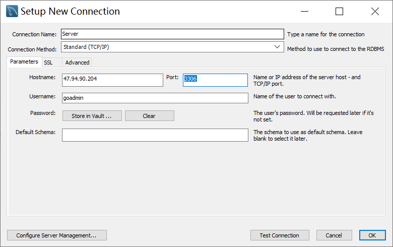
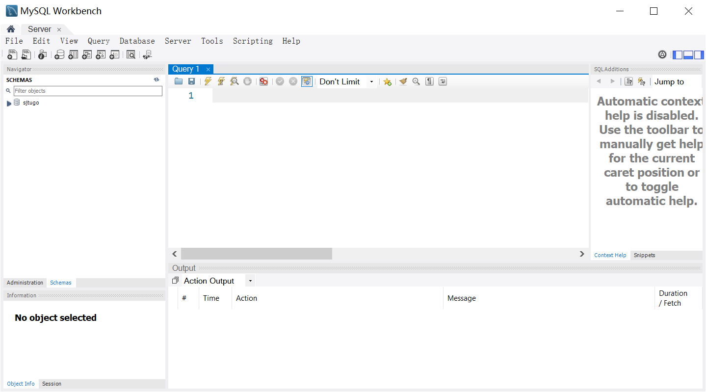

在部署WordPress一文中, 我们在服务器中安装了MySQL及配置了用于博客的数据库. 我们希望在服务器端运行更多的MySQL服务. 仅通过命令行的方式不太直观. 因此我们想到使用MySQL WorkBench连接远程服务器中的数据库.

<!-- more -->


环境: 基于[部署WordPress](http://www.ltzhou.com/vps-1/)一文中的服务器和MySQL配置.

## 创建新用户

首先在本地命令行用SSH连接服务器.
```
ssh root@ltzhou.com
```

创建新用户, 赋予本地管理的权限.
```
mysql -uroot -p
> mysql CREATE DATABASE sjtugo DEFAULT CHARACTER SET UTF8mb4 COLLATE utf8mb4_bin;
> mysql GRANT ALL ON sjtugo.* TO 'goadmin'@'localhost' IDENTIFIED BY 'password';
> mysql FLUSH PRIVILEGES;
```

## 授予远程连接权限

为了使远程连接成功, 我们需要配置用于远程连接的权限, [reference](https://blog.csdn.net/qq_40995335/article/details/80973466)

例如，让用户名为myuser使用密码为mypassword从任何主机连接到mysql服务器
```
GRANT ALL PRIVILEGES ON *.* TO 'myuser'@'%' IDENTIFIED BY 'mypassword' WITH GRANT OPTION;
FLUSH   PRIVILEGES;
```


允许用户myuser从ip为118.184.1.3的主机连接到mysql服务器，并使用mypassword作为密码
```
GRANT ALL PRIVILEGES ON *.* TO 'myuser'@'118.184.1.3' IDENTIFIED BY 'mypassword' WITH GRANT OPTION;
FLUSH   PRIVILEGES;
```

如果你想允许用户myuser从ip为192.168.1.6的主机连接到mysql服务器的dk数据库，并使用mypassword作为密码
```
GRANT ALL PRIVILEGES ON dk.* TO 'myuser'@'192.168.1.3' IDENTIFIED BY 'mypassword' WITH GRANT OPTION;
FLUSH   PRIVILEGES;
```

我们采用如下配置:
```
GRANT ALL PRIVILEGES ON sjtugo.* TO 'goadmin'@'%' IDENTIFIED BY 'passwd' WITH GRANT OPTION;
FLUSH PRIVILEGES;
```
检查是否读写成功
``` 
show grants for 'goadmin'@'%' ;
```

CTRL+D退出mysql命令行

此外, 在Ubuntu中, 还要修改mysql的配置文件, 打开远程连接.
```
vim /etc/mysql/mysql.conf.d/mysqld.cnf
```

将`bind-address = 127.0.0.1` 注释掉.

随后重启MySQL,
```
/etc/init.d/mysql restart
```

最后, 如果是在阿里云中, 记得配置相关安全组.


## 配置MySQL WorkBench



填入相关信息, 连接成功.

